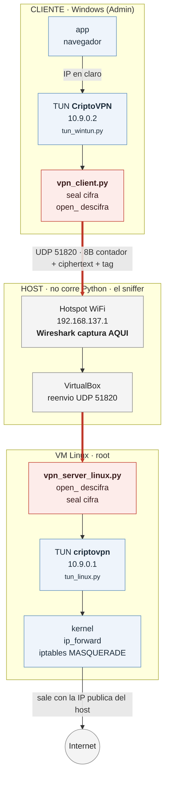
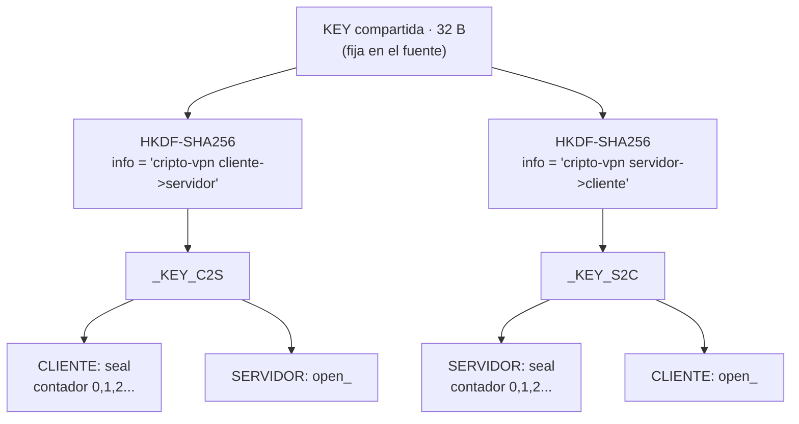

# VPN educativa con ChaCha20-Poly1305

Túnel UDP que transporta **paquetes IP reales** (no texto) cifrados con
**ChaCha20-Poly1305**, con nonce por contador, claves por dirección y
anti-replay — el mismo esquema criptográfico de WireGuard. Repo:
https://github.com/Danochoa09/vpn-cripto-chacha20

Hay **dos formas de correrlo**:

- **Modo A — Túnel Windows↔Windows (sin internet):** dos portátiles unen un
  túnel cifrado y se hacen ping / transfieren archivos. Simple, no requiere
  VM. Prueba el núcleo de la VPN.
- **Modo B — Con salida a internet (VPN completa):** el servidor corre en una
  **VM Linux** (VirtualBox) que hace NAT, y el cliente Windows navega internet
  por el túnel cifrado. Necesario porque Windows 11 **cliente** no tiene NAT
  en-caja (`MSFT_NetNat` no existe; ICS no bincula Wintun; RRAS es solo
  Server). Linux lo resuelve con `iptables MASQUERADE`.

## Arquitectura (Modo B)

Tres máquinas. **Las flechas gruesas son el tramo cifrado**; todo lo demás va en
claro. Fíjate en qué corre dónde: el host **no ejecuta Python** y por eso nunca
tiene un adaptador `CriptoVPN` — solo ve pasar el UDP opaco.



`tunnel_crypto.py` es **el mismo archivo en los dos extremos** — solo cambia el
`role`, que decide qué clave cifra y cuál descifra. El host es un sniffer con
acceso legítimo al cable y aun así no ve nada: nunca tiene la clave.

Subred del túnel: **`10.9.0.0/24`** — servidor `10.9.0.1`, cliente `10.9.0.2`.
Se elige `10.9.0.x` para no chocar con la WiFi/hotspot (ej. el Mobile Hotspot
de Windows usa `192.168.137.x`).

---

## Archivos

| Archivo | Rol |
|---|---|
| `tunnel_crypto.py` | **Núcleo cripto** (Windows y Linux): ChaCha20-Poly1305 + anti-replay. Paquete = `[8B contador][ciphertext+tag]` |
| `tun_wintun.py` | Interfaz TUN en Windows vía `wintun.dll` (ctypes) |
| `tun_linux.py` | Interfaz TUN en Linux vía `/dev/net/tun` |
| `vpn_client.py` | Cliente (Windows): cifra lo saliente, descifra lo entrante |
| `vpn_server.py` | Servidor **Windows** (Modo A): TUN + UDP |
| `vpn_server_linux.py` | Servidor **Linux** (Modo B, en la VM): TUN + UDP |
| `setup_vm.sh` | (VM) IP del TUN `10.9.0.1` + `ip_forward` + `iptables MASQUERADE` |
| `setup_client.ps1` | (Cliente) IP del TUN + rutas para mandar TODO el internet por el túnel + DNS + **anti-fugas**: bloquea IPv6 y pone un kill switch de DNS |
| `teardown.ps1` | (Cliente) **Obligatorio al terminar**: retira el kill switch y restaura IPv6. Sin él, el equipo se queda sin DNS |
| `setup_server_nonat.ps1` / `setup_client_nonat.ps1` | Modo A: un comando por lado (túnel sin internet) |
| `setup_server.ps1` | Intento de NAT/ICS en Windows (no funciona en Home) — referencia |
| `get_wintun.ps1` | Descarga `wintun.dll` |
| `test_crypto.py` | Pruebas: roundtrip, integridad, replay, fuera de orden |
| `demo/secreto.txt` | "Secreto" (contraseña/tarjeta/token falsos) para la prueba de Wireshark |

## Requisitos

- **Cliente (Windows):** Python 3.11+, `pip install cryptography`, `wintun.dll`
  junto a los `.py` (`get_wintun.ps1` lo descarga), y **Administrador** (crear
  el TUN necesita privilegios).
- **Modo A servidor (Windows):** igual que el cliente.
- **Modo B servidor:** VirtualBox + una VM Ubuntu Server (ver abajo).
- **Red:** el cliente debe alcanzar al host en UDP 51820. Lo más confiable es
  el **hotspot del host** (host comparte por WiFi, cliente se une). También
  sirve un router WiFi común, salvo que tenga *AP isolation* (WiFi público
  suele bloquear cliente↔cliente).

---

# MODO A — Túnel cifrado Windows↔Windows (sin internet)

Prueba el cifrado sin VM. Cada equipo: dos terminales Admin (una para el
Python que queda corriendo, otra para configurar).

### 0. Ambos equipos (una vez)
```
pip install cryptography
powershell -ExecutionPolicy Bypass -File get_wintun.ps1
```

### Servidor (Windows)
```
python vpn_server.py                                  # terminal Admin 1 (dejar)
```
En otra terminal Admin:
```
New-NetIPAddress -InterfaceAlias CriptoVPN -IPAddress 10.9.0.1 -PrefixLength 24
New-NetFirewallRule -DisplayName "CriptoVPN UDP"  -Direction Inbound -Protocol UDP    -LocalPort 51820 -Action Allow
New-NetFirewallRule -DisplayName "CriptoVPN ICMP" -Direction Inbound -Protocol ICMPv4 -IcmpType 8 -Action Allow
ipconfig     # anota la IP por la que el cliente te alcanza (hotspot: 192.168.137.1)
```

### Cliente (Windows)
```
python vpn_client.py <IP_SERVIDOR>                    # terminal Admin 1 (dejar)
```
En otra terminal Admin:
```
New-NetIPAddress -InterfaceAlias CriptoVPN -IPAddress 10.9.0.2 -PrefixLength 24
ping 10.9.0.1
```
**Ping con respuesta = VPN cifrada funcionando.** (El primer intento puede dar
timeout mientras el TUN levanta.)

---

# MODO B — Internet por el túnel (VM Linux con NAT)

## B1. Crear la VM (una vez)

1. **ISO:** Ubuntu Server 24.04 LTS. Descarga de `releases.ubuntu.com` y
   verifica el SHA256 antes de usar (compara con el `SHA256SUMS` oficial).
2. **VirtualBox → Nueva:** nombre `vpn-nat`, Linux/Ubuntu 64-bit, 2048 MB RAM,
   2 CPU, disco 15 GB. **Marca "Skip Unattended Installation"** (instalación
   manual, para controlar SSH).
3. **Red → Adaptador 1 = NAT** (default; da internet a la VM).
4. **Red → Avanzado → Reenvío de puertos**, agrega 2 reglas:

   | Nombre | Protocolo | Puerto anfitrión | Puerto invitado |
   |---|---|---|---|
   | vpn | UDP | 51820 | 51820 |
   | ssh | TCP | 2222 | 22 |

5. **Instala Ubuntu Server:** red DHCP automática, crea usuario+clave
   (anótalos), y **marca "Install OpenSSH server"**. Sin snaps. Reboot.
   - Si el primer arranque muestra un crash/cuelgue del kernel: **Máquina →
     Reiniciar**. Suele ser transitorio y arranca bien a la segunda.

## B2. Copiar los archivos a la VM (una vez)

Los reenvíos ya están. Desde el **host** (PowerShell), en la carpeta del
proyecto:
```
scp -P 2222 tunnel_crypto.py tun_linux.py vpn_server_linux.py setup_vm.sh <usuario>@localhost:~
```
(Pide la clave del usuario Linux. Copia los 4 archivos a `/home/<usuario>/`.)

En la **VM** instala la librería cripto (si no viene ya):
```
sudo apt update && sudo apt install -y python3-cryptography
python3 -c "from tunnel_crypto import Tunnel; print('cripto OK')"
```

## B3. Arrancar el servidor en la VM (cada sesión)

Cómodo por SSH desde el host: `ssh <usuario>@localhost -p 2222`. Necesitas
**dos** sesiones.

**Sesión 1 — servidor** (dejar corriendo):
```
sudo python3 vpn_server_linux.py
```
Debe imprimir `[SERVIDOR] Túnel UDP escuchando en 51820` y `TUN 'criptovpn' lista.`

**Sesión 2 — NAT** (justo después):
```
sudo bash setup_vm.sh
```
Debe decir `TUN 'criptovpn' -> 10.9.0.1/24` y `MASQUERADE ... listo`.

> ⚠️ **REGLA DE ORO:** cada vez que reinicies `vpn_server_linux.py`, vuelve a
> correr `setup_vm.sh` inmediatamente. El TUN se **recrea** al arrancar el
> servidor (pierde IP y queda *down*); sin re-configurarlo, escribir en él da
> `OSError: [Errno 5] Input/output error`.

## B4. Host laptop

El host **no corre Python**. Solo:
- **Hotspot WiFi encendido** (el cliente se une) — o ambos en el mismo router.
- **VirtualBox con la VM `vpn-nat` corriendo** (si la cierras, se cae el servidor).
- Reenvío UDP 51820 (permanente) y regla de firewall UDP 51820 (permanente):
  ```
  Get-NetFirewallRule -DisplayName "CriptoVPN UDP" -EA SilentlyContinue | Select DisplayName, Enabled
  # si falta:
  New-NetFirewallRule -DisplayName "CriptoVPN UDP" -Direction Inbound -Protocol UDP -LocalPort 51820 -Action Allow
  ```
- Verifica los reenvíos:
  ```
  & "C:\Program Files\Oracle\VirtualBox\VBoxManage.exe" showvminfo vpn-nat | Select-String "Rule"
  ```
  Deben aparecer `udp 51820` y `tcp 2222`. Para agregar el UDP en vivo:
  ```
  & "C:\Program Files\Oracle\VirtualBox\VBoxManage.exe" controlvm vpn-nat natpf1 "vpn,udp,,51820,,51820"
  ```

`<IP_SERVIDOR>` = IP del host que el cliente alcanza:
- Cliente unido al **hotspot del host** → la **puerta de enlace** del cliente
  (típico `192.168.137.1`).
- Ambos en el **mismo router WiFi** → la **IPv4 WiFi del host** (`ipconfig`).

Confírmalo antes del túnel: en el cliente `ping <IP_SERVIDOR>` debe responder.

## B5. Cliente (Windows, Administrador)

**Terminal Admin 1** (dejar corriendo) — un solo `vpn_client.py`:
```
python vpn_client.py <IP_SERVIDOR>
```
**Terminal Admin 2** — IP del túnel y rutas de internet:
```
New-NetIPAddress -InterfaceAlias CriptoVPN -IPAddress 10.9.0.2 -PrefixLength 24
ping 10.9.0.1                      # Fase A: túnel a la VM
powershell -ExecutionPolicy Bypass -File setup_client.ps1 -ServerIP <IP_SERVIDOR>
```
`setup_client.ps1` manda TODO el internet por el túnel (rutas `0.0.0.0/1` +
`128.0.0.0/1` vía `10.9.0.1`), fija una ruta al host por la red física para no
hacer bucle, y pone el DNS del túnel.

### Prueba por fases (cliente)
```
ping 10.9.0.1        # A: túnel a la VM
ping 8.8.8.8         # B: internet por el NAT de la VM
nslookup google.com  # C: DNS por el túnel
```
Luego abre una web. Con esto, un sniffer entre cliente y host solo ve UDP
cifrado, **incluso navegando internet**.

## Cerrar (Modo B)

> ⚠️ **`teardown.ps1` es OBLIGATORIO en el cliente. Reiniciar no basta.**
> `setup_client.ps1` deja dos cosas **persistentes**, que sobreviven al reboot:
> el kill switch de DNS (regla de firewall) e IPv6 desactivado en la física.
> Si solo haces Ctrl+C, **el equipo se queda sin resolver DNS** — no es un bug,
> es el kill switch haciendo su trabajo con el túnel muerto.

- **Cliente:** Ctrl+C `vpn_client.py`, y **después**:
  ```
  powershell -ExecutionPolicy Bypass -File teardown.ps1
  ```
  Debe imprimir `Kill switch DNS retirado` e `IPv6 restaurado en ...`. Si alguno
  falla, avisa con el comando manual — hazlo, o te quedas sin DNS.
- **VM:** Ctrl+C el servidor. El TUN desaparece.
- Las rutas `/1` y la IP del túnel se van solas: cuelgan del adaptador
  `CriptoVPN`, que Wintun borra al morir el proceso.

---

# Orden correcto de arranque (Modo B) — resumen

```
1. Host:   hotspot ON + VM prendida + reenvío UDP 51820 + firewall
2. VM:     sudo python3 vpn_server_linux.py     (sesión 1, dejar)
3. VM:     sudo bash setup_vm.sh                (sesión 2)   <- SIEMPRE tras (2)
4. Cliente: python vpn_client.py <IP_SERVIDOR>  (Admin 1, dejar)
5. Cliente: New-NetIPAddress ... 10.9.0.2  +  setup_client.ps1
6. Cliente: ping 10.9.0.1 -> 8.8.8.8 -> nslookup
```
**Qué corre dónde:** Host = nada de Python (hotspot + VM). VM =
`vpn_server_linux.py` + `setup_vm.sh`. Cliente = `vpn_client.py` + rutas.

---

# Troubleshooting (cosas que pasaron)

| Síntoma | Causa | Arreglo |
|---|---|---|
| VM crashea/cuelga en el 1er arranque | Transitorio de virtualización | **Máquina → Reiniciar**; arranca a la 2ª |
| `OSError: [Errno 5]` al escribir en el TUN (VM) | El TUN se recreó al reiniciar el servidor, sin IP/up | Re-correr `sudo bash setup_vm.sh` |
| Tormenta de `replay descartado`, ping no vuelve | Dos `vpn_client.py` corriendo (contadores colisionan), o reiniciaste un solo lado | Dejar **un solo** cliente; reiniciar servidor y cliente **juntos** (ver nota de reinicios) |
| `paquete alterado/ajeno descartado` suelto en el servidor | UDP ajeno al 51820: escaneo, basura de red, un cliente viejo | **Normal.** Se descarta y el túnel sigue. Solo importa si es constante *y* el ping no vuelve |
| Con la VPN arriba, Wireshark sigue mostrando `dns` en claro | Fuga IPv6 (`Type: IPv6 (0x86dd)`) o fuga v4 del resolver | Re-correr `setup_client.ps1`: bloquea IPv6 y pone el kill switch de 53. Ver "Las tres fugas" |
| **El cliente no resuelve nada** (web ni `nslookup`), pero `ping 8.8.8.8` sí anda | El **kill switch de DNS** sigue puesto con el túnel muerto. Falla cerrado a propósito. La regla es persistente: sobrevive al reboot | `powershell -ExecutionPolicy Bypass -File teardown.ps1` en el cliente |
| Tras la demo, el cliente quedó sin DNS o sin IPv6 | No se corrió `teardown.ps1`; ambos cambios son persistentes | `teardown.ps1`. A mano: `Get-NetFirewallRule -DisplayName "CriptoVPN kill switch DNS" \| Remove-NetFirewallRule` y `Enable-NetAdapterBinding -Name "Wi-Fi" -ComponentID ms_tcpip6` |
| `CriptoVPN` con IP `169.254.x.x` (APIPA) | No se asignó la IP del túnel | `New-NetIPAddress -InterfaceAlias CriptoVPN -IPAddress 10.9.0.2 -PrefixLength 24` |
| `ping 10.9.0.1` timeout pero `ping <IP_SERVIDOR>` OK | Túnel no llega a la VM | Verificar reenvío UDP 51820 (VBoxManage) y que el servidor+`setup_vm.sh` estén activos |
| `WinError 10051 red no accesible` al lanzar el cliente | `<IP_SERVIDOR>` es `169.254.x.x` (sin DHCP) o mal | Usar la IP/puerta de enlace correcta (host en la misma red) |

**Nota sobre reinicios:** los contadores anti-replay del cliente y del
servidor están acoplados. Si reinicias **solo** un lado, el otro puede
rechazar los paquetes como "viejos"/replay. Para reiniciar limpio, **reinicia
ambos** (y en la VM vuelve a correr `setup_vm.sh`).

---

# Criptografía: ChaCha20-Poly1305 + anti-replay (estilo WireGuard)

Cada paquete se cifra, se autentica y lleva número de secuencia:

- **Confidencialidad + integridad:** Poly1305 añade un tag de 16 bytes.
  Alterar un bit del contador, del ciphertext o del tag → falla el descifrado
  (`InvalidTag`) y se descarta.
- **Nonce por contador:** el nonce se deriva de un contador de 64 bits
  monótono, no aleatorio → nunca se repite (cero riesgo de colisión).
- **Clave por dirección:** subclaves HKDF distintas c→s y s→c, así ambos
  extremos empiezan el contador en 0 sin colisionar.
- **Anti-replay:** ventana deslizante (RFC 6479) de contadores vistos; un
  datagrama repetido o muy viejo se rechaza (`ReplayError`). La verificación
  va **después** de autenticar, para que nadie envenene la ventana con
  contadores falsos.

## Por qué DOS claves y no una

Es la decisión menos obvia del diseño, y la que evita un desastre:



**El problema que resuelve:** los dos extremos arrancan su contador en 0, y el
nonce se deriva del contador. Con una sola clave, el primer paquete del cliente
y el primer paquete del servidor usarían **el mismo (clave, nonce)** — reuso de
nonce, el fallo catastrófico de todo cifrado de flujo: XOR de los dos
ciphertexts y el keystream desaparece.

Con una clave por dirección, cada par `(clave, contador)` es único aunque ambos
cuenten desde 0. Es lo mismo que hace WireGuard, y `test_crypto.py` lo verifica:
mismo plaintext y mismo contador desde los dos lados → ciphertexts distintos.

Demo:
```
python test_crypto.py    # roundtrip, bit-flip (Poly1305), replay, fuera de orden
```

---

# Demostrar el cifrado en Wireshark

**Elegir la interfaz — y la máquina.** Cada interfaz solo existe en un equipo:

| Máquina | Interfaz | Ve |
|---|---|---|
| **Host** | `Conexión de área local* N` (el AP virtual del hotspot, `192.168.137.x`) | tráfico **cifrado** |
| **Cliente** | `CriptoVPN` (`10.9.0.2`) | tráfico **descifrado** |
| **VM** | `criptovpn` (`10.9.0.1`), con `tcpdump` | tráfico **descifrado** |

El host **no tiene `CriptoVPN` y nunca lo va a tener**: lo crea Wintun al
arrancar `vpn_client.py`, y eso pasa en el cliente. En el host solo capturas lo
cifrado — que es lo que quieres.

Con hotspot, el adaptador del túnel **NO es "Wi-Fi"** sino una "Conexión de área
local\* N". Para hallar cuál: lanza un ping continuo y mira cuál dibuja
actividad en la pantalla de bienvenida de Wireshark. El número cambia entre
equipos, no lo adivines.

`CriptoVPN` es efímero (muere con el proceso) y Wireshark enumera las interfaces
**al abrirse**: si no aparece, `Capturar → Actualizar interfaces` (F5) con
`vpn_client.py` ya corriendo.

### Contraste ping (mismo paquete, dos caras)
Captura a la vez en el hotspot (`udp.port == 51820`) y en `CriptoVPN` (`icmp`),
haz `ping 10.9.0.1`:
- Hotspot → UDP con `[contador][ciphertext+tag]`, ilegible.
- `CriptoVPN` → `Echo request/reply` en claro entre `10.9.0.x`.

### Prueba estrella: texto plano vs cifrado con el "secreto"

Sirve `demo/secreto.txt` por HTTP y compara sin/con túnel. Capturas siempre en
el **host**, en el adaptador del hotspot. Lo único que cambia es **a qué
destino** apunta el `curl` — y con eso, si el tráfico entra al túnel o no.

Firewall del host (una vez): `New-NetFirewallRule -DisplayName "HTTP demo" -Direction Inbound -Protocol TCP -LocalPort 8000 -Action Allow`

Copia el secreto a la VM (una vez, desde el **host**, en la carpeta del proyecto):
```
ssh -p 2222 <usuario>@localhost "mkdir -p ~/demo"     # scp no crea directorios
scp -P 2222 demo/secreto.txt <usuario>@localhost:~/demo/
```

| | **SIN VPN** | **CON VPN** |
|---|---|---|
| **Sirve** | Host: `cd demo` + `python -m http.server 8000 --bind 192.168.137.1` | VM: `cd ~/demo` + `python3 -m http.server 8000 --bind 10.9.0.1` |
| **Cliente pide** | `curl.exe http://192.168.137.1:8000/secreto.txt` | `curl.exe http://10.9.0.1:8000/secreto.txt` |
| **Filtro (host)** | `tcp.port == 8000` | `udp.port == 51820` |
| **Seguir flujo** | **HTTP** → se lee `CONTRASENA: unal2026` | **UDP** → ruido cifrado |
| **`tcp.port == 8000`** | lleno | **cero paquetes** |
| **Guardar** | `sin_vpn.pcapng` | `con_vpn.pcapng` |

El destino es la variable: `192.168.137.1` es el host, en la subred del cliente
→ nunca entra al túnel. `10.9.0.1` es la VM, al otro lado → solo se llega
cifrado.

**Golpe de gracia:** en cada captura, **Edición → Buscar paquete** → modo
*Cadena*, ámbito "Bytes del paquete" → `CONTRASENA`.
- `sin_vpn.pcapng`: **la encuentra** (viaja en claro).
- `con_vpn.pcapng`: **no la encuentra** (cifrada).

Verifica que el `curl` devuelve el contenido antes de creerle a Wireshark: un
404 (ruta mal, `/demo/secreto.txt` en vez de `/secreto.txt` si hiciste
`cd ~/demo`) también da una captura sin el secreto, y parece un éxito.

### Prueba de 4 protocolos (SIN vs CON VPN)

La más completa. Captura siempre en el **host**, en el adaptador del hotspot:
ahí el host no simula un espía, **es** uno — el UDP del cliente le entra por el
hotspot y VirtualBox lo reenvía a la VM. Sniffer legítimo en mitad del túnel.

Genera los cuatro desde el cliente:

| Protocolo | Comando (cliente) | Filtro (host) | SIN VPN se ve |
|---|---|---|---|
| **ICMP** | `ping 8.8.8.8` | `icmp` | tipo, IPs, hasta el payload |
| **DNS** | `nslookup unal.edu.co` | `dns` | **qué sitios visitas** |
| **HTTP** | `curl.exe http://<destino>:8000/secreto.txt` | `http` | la contraseña completa |
| **HTTPS** | `curl.exe https://www.unal.edu.co` | `tls.handshake.extensions_server_name` | **el dominio** (SNI) |

Con la VPN arriba, los cuatro filtros dan **cero paquetes**.

**Un filtro para los cuatro.** `<IP_CLIENTE>` = la IP del cliente **en el
hotspot** (`ipconfig` en el cliente → IPv4 del Wi-Fi; el DHCP reparte por lo
alto del rango, p. ej. `192.168.137.230`). **No la confundas con `10.9.0.2`**,
que es su IP dentro del túnel:
```
ip.addr == <IP_CLIENTE> && (icmp || dns || http || tls)
```
SIN VPN: lleno. CON VPN: vacío. Mismo filtro, misma interfaz, misma
navegación — **cambia una sola variable**. Si cambias el filtro entre capturas,
siempre queda la duda de si el filtro hizo el truco.

Variante por ausencia, más contundente que mostrar ciphertext:
```
ip.addr == <IP_CLIENTE> && !(udp.port == 51820)
```
Todo lo del cliente que no sea el túnel. Con VPN queda casi vacío: no pruebas
que *algo* está cifrado, pruebas que **no queda nada afuera**.

**La imagen para el informe:** `Estadísticas → Jerarquía de protocolos`.
SIN VPN el árbol entero (TCP, TLS, DNS, ICMP, HTTP); CON VPN ~100% UDP. Dos
capturas de pantalla lado a lado, sin necesidad de saber filtrar.

**El HTTPS es el que gana la defensa.** Responde a *"¿para qué VPN si hoy todo
es HTTPS?"*: sin túnel, el contenido ya va cifrado, pero el **SNI del
ClientHello viaja en claro** y el sniffer ve qué dominio visitas. HTTPS protege
el *qué dices*, no el *con quién hablas*. Con el túnel, ni eso.

> ⚠️ **El destino importa tanto como el túnel.** Con la VPN arriba, apuntar al
> host (`192.168.137.1`) **no pasa por el túnel**: está en la subred del cliente
> (la ruta conectada `/24` gana a las `/1`) y además `setup_client.ps1` le fija
> una ruta `/32` por la física para evitar el bucle. Para la captura CON VPN el
> destino debe estar **al otro lado**: la VM (`10.9.0.1`). Si curleas al host
> con la VPN prendida verás el secreto en claro y parecerá que la VPN falló.

> ⚠️ **`setup_client.ps1` cierra tres fugas. Todas se midieron aquí, con el
> cifrado funcionando sin un solo fallo.** Están documentadas abajo, en
> "Las tres fugas": vale la pena entenderlas, porque son el corazón del
> proyecto — ninguna es de criptografía.
>
> Filtros para verlas: `dns && ipv6` (fuga v6) vs `dns && ip` (fuga v4).
> **Ojo:** `ip.addr` en Wireshark es **solo IPv4** y nunca matchea paquetes v6 —
> por eso una fuga IPv6 se pasa por alto tan fácil.

> **`curl` en PowerShell no es curl** — es alias de `Invoke-WebRequest`. Usa
> `curl.exe` para la salida cruda.

> **Sobre webs reales:** con **Modo B** el internet del cliente SÍ va por el
> túnel, así que un sniffer entre cliente y host ve solo UDP cifrado. Pero los
> sitios reales ya usan HTTPS (TLS): sin la VPN tampoco verías el contenido,
> solo el dominio (SNI/DNS) — que es justo lo que mide la prueba de 4
> protocolos. El contraste "texto legible → cifrado" se aprecia mejor con el
> `http.server` local en claro.

---

# Las tres fugas (y por qué ninguna era de cifrado)

Documentar las capturas destapó tres fugas reales. En las tres, el
ChaCha20-Poly1305 funcionaba **sin un solo fallo**. Lo que se fuga es lo que
**nunca entra al túnel**, y eso lo decide el enrutamiento y el sistema
operativo, no la criptografía. Es la razón de que una VPN sea mucho más que su
AEAD.

| # | Cómo se veía | Causa | Cierre |
|---|---|---|---|
| 1 | `curl` al host devolvía el secreto **en claro con la VPN arriba** | `192.168.137.1` está en la subred del cliente: la ruta conectada `/24` gana a las `/1` del túnel | No es un bug: el host es inalcanzable *a través* del túnel **por diseño** (evita el bucle). Para la prueba CON VPN el destino debe ser la VM (`10.9.0.1`) |
| 2 | `dns` en claro, `Type: IPv6 (0x86dd)` | Las rutas `/1` son **IPv4**; el IPv6 no tiene ruta al túnel y sale por la física | `setup_client.ps1` desactiva IPv6 en la física. Se bloquea en vez de tunelizarlo: la VM (tras el NAT de VirtualBox) no tiene IPv6, así que transportarlo cambiaría la fuga por un agujero negro |
| 3 | `dns` en claro por IPv4, **con las rutas `/1` sanas** | El cliente DNS de Windows ata la consulta a la interfaz y **no consulta la tabla de rutas** | Kill switch: bloquear el puerto 53 saliente en la física |

## La nº3 merece su párrafo

Es la más instructiva porque **refuta el razonamiento**. Con la VPN arriba y las
rutas `/1` verificadas:

```
tracert -d -h 2 1.1.1.1   ->  primer salto 10.9.0.1   (por el túnel)
consulta DNS a 1.1.1.1    ->  en claro por el WiFi    (fuera del túnel)
```

**Mismo destino, dos caminos a la vez.** El cliente DNS de Windows manda la
consulta *por* la interfaz cuyo servidor está usando (*smart multi-homed name
resolution*), con el socket bindeado, saltándose la tabla de rutas. `tracert`
hace un lookup normal y va al túnel; el resolver no.

De ahí se sigue que **cambiar el servidor DNS no arregla nada** — solo cambia a
quién se le fuga (primero al DNS del hotspot, después a `1.1.1.1`, siempre en
claro). Si no puedes redirigir la consulta, cortas el camino. Por eso el kill
switch bloquea el puerto en vez de reconfigurar el resolver.

Ninguna de las tres se dedujo razonando. Salieron de mirar la red.

## Precedente

La fuga nº2 **la tiene WireGuard**: `AllowedIPs = 0.0.0.0/0` sin `::/0` produce
exactamente esto. Es de las fugas más documentadas que existen, y muchos
clientes VPN comerciales la resuelven igual que aquí — desactivando IPv6 en vez
de soportarlo.

---

# Qué lo diferencia de una VPN real

Implementa **bien el núcleo criptográfico** (ChaCha20-Poly1305 + nonce por
contador + anti-replay), pero una VPN de producción tiene capas que aquí se
omiten:

| Aspecto | Este proyecto | VPN real |
|---|---|---|
| **Intercambio de claves** | Clave maestra fija en el código | Handshake Diffie-Hellman efímero (X25519) |
| **Forward secrecy** | No (clave estática) | Sí: claves de sesión que rotan |
| **Autenticación de extremos** | Ninguna: quien tiene la clave entra | Claves públicas/certificados por peer |
| **Rekeying** | Nunca (límite: contador de 64 bits) | Renegocia claves por tiempo/volumen |
| **Handshake / sesión** | No hay; aprende la IP del 1er paquete **autenticado** | Handshake con anti-DoS (cookies) |
| **Multi-cliente** | Uno a la vez (contador/ventana únicos) | Muchos peers, claves por peer |
| **Salida a internet** | Sí, vía VM Linux con NAT (Modo B) | NAT/routing nativo, split-tunnel, DNS push |
| **Keepalive / reconexión** | Keepalive básico | Detección de peer muerto, roaming |
| **PMTU** | MTU manual (~1400) | Descubrimiento de MTU |
| **IPv6** | Solo IPv4; el cliente lo **bloquea** para que no se fugue sin cifrar | IPv4 + IPv6 tunelizados |
| **Rendimiento** | Python en espacio de usuario | Kernel/driver, cifrado por hardware |
| **Multiplataforma** | Windows (Wintun) + Linux (VM) | Windows, Linux, macOS, móviles |

**Las 3 diferencias clave para la defensa:**
1. **Sin intercambio de claves ni forward secrecy** — la clave está en el
   fuente; quien la vea descifra todo, presente y pasado.
2. **Sin autenticación de extremos** — no se verifica *quién* es el otro lado,
   solo que comparte la clave.
3. **Sin handshake/rekeying** — una sola clave estática toda la vida.

Lo que **sí** está a la altura: cifrado autenticado por paquete
(ChaCha20-Poly1305), nonce por contador que nunca se repite, claves por
dirección y anti-replay con ventana deslizante. El corazón criptográfico está
bien hecho.
